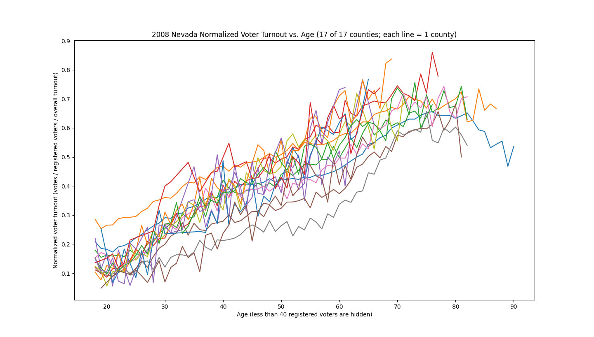

# Checking for Voting Machine Fraud in the State of Nevada

This checks for patterns between voter turnout and age in Nevada in the 2020 General Presidential Election.

## Results

The outlier with 90%+ turnout over all age groups is White Pine county. The 2020 voter roll is used for all plots.

## Setup

Requires python3.

## Running

1. Obtain voter list. See Data Source.
2. Move and rename the eligible voter list file to `./data/voters.csv`
3. Move and rename the voter history file to `./data/votes.csv`
4. Plot turnout vs. age for all counties by running: `./plot_turnout_by_age.py`
    You can also plot just one county by running: `./plot_turnout_by_age.py COUNTY_NAME`, e.g. `./plot_turnout_by_age.py "Carson City"`

## Data source

The Nevada voter list and voter history are free, but you must first request access: https://www.nvsos.gov/sos/elections/voters/nevvoter-statewide-list

Voting machine vendor list: https://www.nvsos.gov/sos/elections/election-resources/voting-system

